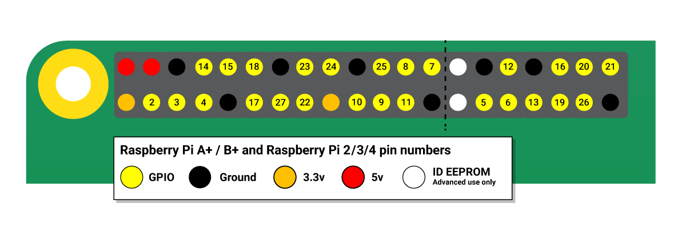

# Knock Knock - Video Calling Doorbell
> This Project is developed using a Raspberry Pi, Google Duo and Python.

- When the doorbell button is pressed the Pi makes a high-quality video call using Google Duo, which can be answered on a phone, tablet or computer, letting you see and speak to callers when you're away from home. It works over Internet.

- It also sounds a standard doorbell inside the house as a fail-safe, in case the call can't be taken.

## Connections:

## References: 

[1. https://www.circuito.io/](https://www.circuito.io/)
[2. https://www.instructables.com/id/1986-Raspberry-Pi-Video-Doorbell/](https://www.instructables.com/id/1986-Raspberry-Pi-Video-Doorbell/)
[3. https://github.com/MisterEmm/pingdoorbell](https://github.com/MisterEmm/pingdoorbell)
[4. https://github.com/PyUserInput/PyUserInput](https://github.com/PyUserInput/PyUserInput)
[5. https://learn.sparkfun.com/tutorials/how-to-run-a-raspberry-pi-program-on-startup/all](https://learn.sparkfun.com/tutorials/how-to-run-a-raspberry-pi-program-on-startup/all)